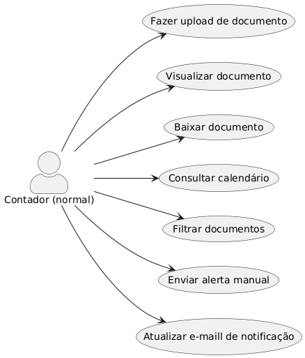
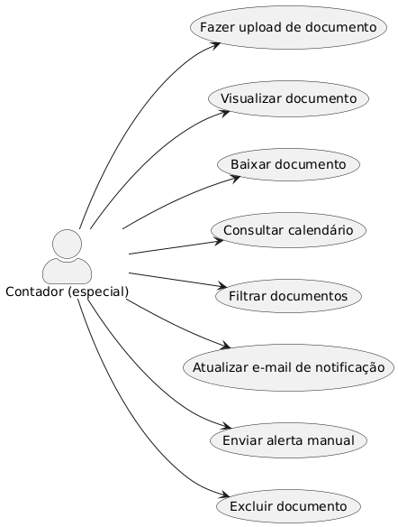

# SGOT - Sistema de Gestão de Obrigações Tributárias
📌 **Acesse o repositório no GitHub:** [SGOT - Sistema de Gestão de Obrigações Tributárias](https://github.com/edsonpolucena/SGOT)

## Capa
**Título do Projeto:** SGOT - Sistema de Gestão de Obrigações Tributárias  
**Nome do Estudante:** Edson Borges Polucena  
**Curso:** Engenharia de Software  
**Data de Entrega:** 07/11/2025  

## 🧾 Resumo

Neste documento é apresentado a especificação do Sistema de Gestão de Obrigações Tributárias, uma solução digital desenvolvida para auxiliar escritórios contábeis e empresas no controle e organização de documentos fiscais, garantindo o cumprimento de prazos legais. Considerando que 27% das micro e pequenas empresas apresentavam dívidas em atraso em janeiro de 2023, e que 63% dos MEI comprometeram ao menos 30% de seus custos mensais com dívidas, o desenvolvimento de uma ferramenta que previna atrasos e multas torna-se essencial para reduzir perdas financeiras e melhorar a saúde fiscal das empresas (AGÊNCIA SEBRAE, 2023).
O sistema permite o upload de documentos tributários, envio de notificações automáticas por e-mail, visualização de um calendário com prazos e valores a pagar, geração de relatórios e visualização de indicadores em painéis gerenciais. Em janeiro de 2024, 6,7 milhões de CNPJs encontravam-se em situação de inadimplência, totalizando R$ 127,8 bilhões em débitos, com ticket médio de R$ 2.705,20 e 7,1 contas em atraso por empresa (SERASA EXPERIAN, 2024). O objetivo é modernizar e centralizar o processo de gerenciamento tributário, promovendo maior segurança, eficiência e rastreabilidade, minimizando a incidência de multas que chegam a 0,33% ao dia, limitadas a 20% do tributo devido (TAXGROUP, 2024).

---
---

## 1. Introdução

### Contexto

A gestão tributária é uma atividade crítica para empresas e escritórios contábeis, pois envolve o cumprimento de diversas obrigações fiscais dentro de prazos estabelecidos pela legislação. A ausência de um controle eficiente pode gerar multas moratórias de até 20% do valor do tributo e juros de 0,33% ao dia, além de danos à credibilidade e à saúde financeira do cliente. (TAXGROUP, 2024)
Segundo levantamento do Sebrae em parceria com o IBGE, 27% das micro e pequenas empresas apresentavam dívidas em aberto em janeiro de 2023, ante 24% em agosto de 2022. Dentre os MEI, 63% reportaram comprometer ao menos 30% de seus custos mensais no pagamento de contas em atraso. (AGÊNCIA SEBRAE, 2023)

### Justificativa

Este projeto se destaca por implementar uma ferramenta digital que utiliza tecnologias modernas para facilitar o controle e organização das obrigações tributárias, promovendo maior segurança, automação e eficiência nos processos contábeis, tais como:
-	Redução de multas no Simples Nacional: multas de ofício podem atingir 2% do valor devido por competência, limitadas a 20% do total, e juros de 1% ao mês (CPA, 2025).
-	Mitigação de penalidades administrativas: as sanções previstas na Lei Anticorrupção variam de 0,1% a 20% do faturamento bruto anual, com limite mínimo de R$ 6.000 (CGU, 2015).
-	Negociação de débitos: por meio de programas como o RELP, é possível obter até 90% de desconto em multas e juros em parcelamentos de até 180 meses (GOVERNO FEDERAL, 2025).
Esses dados evidenciam que uma solução automatizada de alertas e acompanhamento de prazos pode prevenir acréscimos que, em média, custam milhares de reais por cliente e preservar a relação fiduciária entre escritórios contábeis e empresas.

### Objetivos

#### Objetivo Geral

Desenvolver um sistema web para gerenciamento e controle digital das obrigações tributárias de empresas do Simples Nacional.

#### Objetivos Específicos

-	Gerar alertas de vencimento
    -	Enviar notificações por e-mail com pelo menos 3 dias de antecedência para 100% dos prazos cadastrados.
-	Permitir upload de documentos
    -	Processar e armazenar cada arquivo em menos de 5 segundos em 95% das requisições.
-	Assegurar alta disponibilidade das notificações
    -	Garantir SLA de 99% de sucesso no envio de e-mails dentro do prazo configurado.
-	Exibir calendário de prazos
    -	Apresentar um calendário interativo com marcação de todos os vencimentos, carregado em menos de 2 segundos.
-	Disponibilizar painel de KPIs
    -	Exibir em dashboard, em tempo real, os seguintes indicadores:
        -	% de prazos cumpridos
        -	% de alertas enviados com sucesso
-	Gerar relatórios gerenciais
    -	Produzir relatórios mensais (PDF/CSV) com o total de impostos (R$) e variação mês a mês.
-	 Permitir download de documentos
    -	Disponibilizar download de arquivos com tempo de resposta de até 3 segundos em 95% dos acessos.
-	Registrar logs de auditoria
    -	Armazenar registros de todas as ações críticas (upload, alerta, download, login) com retenção mínima de 1 ano e consulta em menos de 5 segundos.

---
---
## 2. Descrição do Projeto

### Tema do Projeto

Desenvolvimento de um sistema web para o gerenciamento de obrigações tributárias:

### Problemas a Resolver

-	Falta de organização e controle centralizado de impostos.
-	Esquecimento de prazos e perda de documentos importantes.
-	Dificuldade na comunicação entre o escritório contábil e os clientes.
-	Falta de visibilidade e rastreabilidade sobre ações realizadas.
-	Falta de dados analíticos para tomada de decisão.

### Limitações

-	O sistema não realiza pagamentos de impostos.
-	Não substitui sistemas completos de contabilidade.
-	Não realiza escrituração fiscal ou contábil.
-	Inicialmente, não possui aplicativo mobile nativo.

---
---

## 3. Especificação Técnica

### 3.1 Requisitos de Software

#### Requisitos Funcionais (RF)

-	[Contabilidade] - RF01: Permitir o cadastro e atualização de e-mail para usuários da contabilidade.
-	[Contabilidade] - RF02: Permitir que usuários da contabilidade gerenciem prazos de entrega.
-	[Contabilidade] - RF03: Exibir alertas para documentos pendentes de upload.
-	[Contabilidade] – RF04: Permitir o envio manual de lembretes sobre documentos não visualizados.
-	[Contabilidade] – RF05: Permitir que usuários da contabilidade realizem upload, download e visualização de documentos.
-	[Contabilidade] – RF06: Permitir filtro de documentos por período, status, empresa e tipo.
-	[Contabilidade] – RF07: Permitir comentários e anotações internas em documentos.
-	[Cliente] – RF08: Permitir o download e a visualização de documentos pelo cliente.
-	[Cliente] – RF09: Permitir o cadastro e atualização de e-mail pelos clientes.
-	[Cliente, Contabilidade] – RF10: Exibir um calendário com prazos de vencimento e valores totais a pagar.
-	[Contabilidade Especial] - RF11: Permitir que usuários da contabilidade (permissão especial) deletem documentos postados.
-	[Sistema] – RF12: Notificar clientes via e-mail sobre novos documentos e prazos de vencimento.
-	[Sistema] – RF13: Enviar alerta de documentos não visualizados para clientes.
-	[Sistema] – RF14: Enviar alerta de documentos não visualizados para usuários da contabilidade.
-	[Sistema] - RF15: Registrar logs de ações (visualização, envio, download).
-	[Sistema] - RF16: Detectar e notificar falhas em upload e envio de e-mail, exibindo mensagem de erro e registrando no log.

#### Requisitos Não Funcionais (RNF)

-	RNF01: O sistema deve ser responsivo.
-	RNF02: Utilizar autenticação JWT.
-	RNF03: Sistema de permissões baseado em papéis.
-	RNF04: Criptografia de dados sensíveis.
-	RNF05: Backup automático.
-	RNF06: Logs de auditoria.
-	RNF07: Monitoramento de falhas com Sentry.
-	RNF08: Escalabilidade com Docker e CI/CD.
-	RNF09: Aplicar retry, circuit-breaker e fallback em operações críticas (upload e e-mail).
-	RNF10: Assegurar LGPD (consentimento, criptografia, anonimização e políticas de retenção/exclusão).
-	RNF11: Exportar relatórios e dashboards em PDF/CSV.

---

### 3.1.2 Representação dos Requisitos
Nesta seção, apresentamos a representação dos Requisitos Funcionais (RF) do Sistema de Gestão de Obrigações Tributárias (SGOT) por meio de Diagramas de Casos de Uso (UML), organizados em três perfis de ator: Contador (acesso normal), Contador (acesso especial) e Cliente.

---

#### 3.1.2.1 Diagrama de Caso de Uso - Contador (Acesso Normal)

*Figura 1: Casos de Uso para Contador (acesso normal)*

A Figura 1 apresenta as funcionalidades disponíveis ao ator **Contador (Acesso Normal)**.

- **Upload/Visualizar/Baixar Documento:** permite o acesso aos documentos armazenados, e o envio de arquivos tributários em PDF (RF05).
- **Consultar Calendário:** exibe prazos e valores a pagar (RF11).
- **Filtrar Documentos:** busca por período, status, empresa e tipo (RF07).
- **Enviar Alerta Manual:** dispara lembretes manuais de documentos não visualizados (RF04).
- **Atualizar E-mail de Cliente:** gerencia informações de contato (RF01).

---

#### 3.1.2.2 Diagrama de Caso de Uso - Contador (Acesso Admin)

*Figura 2: Casos de Uso para Contador (acesso admin)*

A Figura 2 apresenta as funcionalidades disponíveis ao ator **Contador (Acesso Admin)**, inclui todas as funcionalidades do Contador (acesso normal), incluindo a funcionalidade abaixo.

- **Excluir Documento:** permite remoção de arquivos postados (RF12).

---

#### 3.1.2.3 Diagrama de Caso de Uso - Contador (Acesso Especial)

*Figura 3: Casos de Uso para Contador (acesso especial)*

A Figura 3 apresenta as funcionalidades disponíveis ao ator **Contador (Acesso Especial)**, inclui todas as funcionalidades do Contador (acesso normal), incluindo a funcionalidade abaixo.

- **Excluir Documento:** permite remoção de arquivos postados (RF12).

---

#### 3.1.2.4 Diagrama de Caso de Uso - Cliente Admin

*Figura 4: Casos de Uso para Cliente Admin*

A Figura 4 apresenta as funcionalidades disponíveis ao ator **Cliente Admin**.

- **Visualizar/Baixar Documento:** acesso aos arquivos compartilhados (RF09).

- **Consultar Calendário:** verifica prazos e valores (RF11).

- **Atualizar E-mail:** altera dados de contato (RF10).

---

#### 3.1.2.5 Diagrama de Caso de Uso - Cliente Normal

*Figura 5: Casos de Uso para Cliente Normal*

A Figura 5 apresenta as funcionalidades disponíveis ao ator **Cliente Normal**.

- **Visualizar/Baixar Documento:** acesso aos arquivos compartilhados (RF09).

- **Consultar Calendário:** verifica prazos e valores (RF11).

---
---
## 3.2 Arquitetura do Sistema (Modelo C4)

A seguir apresentamos a visão arquitetural do projeto utilizando o C4 Model, em dois níveis de detalhe:

### 3.2.1 Diagrama de Contexto  
Este diagrama mostra o SGOT como “caixa-preta”, os atores externos que interagem com ele e as integrações com sistemas externos (e-mail, armazenamento e monitoramento).

*Figura 4: Diagrama de Contexto do Sistema de Gestão de Obrigações Tributárias*

 **Descrição:**  
**Contador** e **Cliente‐Empresa:**
Interagem via HTTP/HTTPS com o sistema principal (SGOT).
##### Sistema de Gestão de Obrigações Tributárias (SGOT): 
Plataforma web que centraliza todo o fluxo de documentos:
-	Recebe uploads de arquivos PDF.
-	Gera e exibe calendário de prazos e valores.
-	Dispara notificações automáticas por e-mail.
-	Registra logs de auditoria e falhas.

##### Serviço de E-mail (SMTP):
Servidor SMTP responsável pelo envio efetivo das mensagens agendadas pelo SGOT (notificações de novos documentos e lembretes de vencimento).
##### Serviço de Armazenamento (S3/HTTPS):
Bucket S3 que guarda de forma segura e durável todos os PDFs tributários, atendendo a operações de upload e download via HTTPS.

---

### 3.2.2 Diagrama de Contêineres  
Neste diagrama, detalhamos todos os **contêineres** que compõem o SGOT: front-end, back-end, banco de dados, workers e serviços externos.

*Figura 5: Diagrama de Contêineres do Sistema de Gestão de Obrigações Tributárias*

 **Descrição:**  
 - **Front-end (React.js):** Interface Single-Page Application responsiva, consumindo a API por REST/JSON.  
 - **API Backend (Node.js / Express + JWT):** Contém a lógica de negócios, roteamento e controle de acesso.  
- **Banco de Dados (PostgreSQL):** Armazena usuários, metadados de documentos, prazos e logs de auditoria.  
 - **Serviço de Notificações (Node.js):** Enfileira alertas e dispara e-mails a partir de uma fila de mensagens.  
- **Serviço de Logs/Auditoria (Node.js):** Registra todas as ações críticas para rastreabilidade.  
 - **Armazenamento (S3):** Bucket que guarda os PDFs tributários.  
 - **SMTP (Servidor de e-mail):** Responsável pelo envio efetivo das mensagens.  

---

<!-- ### 3.2.3 Diagrama de Componentes (Backend)  
Aqui aprofundamos no **API Backend**, mostrando seus principais componentes (controllers e services) e como eles se interligam.

*Figura 6: Diagrama de Componentes do API Backend*

**Descrição:**

- **ControladorAutenticacao**  
  Responsável pelo fluxo de autenticação: recebe credenciais, valida usuário, gera e retorna o token JWT.  
  **Interface:** autenticar(credenciais): JWT

- **ControladorDocumento**  
  Gerencia operações de documentos: upload de PDFs no S3, download via URL pré-assinada e consulta de metadados.  
  **Interfaces:**  
  - enviarDocumento(arquivo): URL  
  - baixarDocumento(id): Stream  
  - obterMetadados(id): Metadados

- **ControladorCalendario**  
  Expõe endpoint para listar prazos e valores associados a uma empresa.  
  **Interface:** listarPrazos(empresaId): Prazo[]

- **MiddlewarePermissao**  
  Intercepta requisições antes dos controllers para verificar papéis e escopos de acesso.  
  **Interface:** verificarPermissao(usuario, acao): boolean

- **ServicoRelatorio**  
  Gera relatórios e dashboards a partir dos dados armazenados e oferece exportação em PDF ou CSV.  
  **Interfaces:**  
  - gerarRelatorio(parametros): PDF  
  - exportarCSV(parametros): CSV

- **ServicoLogAuditoria**  
  Registra em banco de dados cada ação crítica (login, upload, download, consulta de prazos, exportação).  
  **Interface:** registrarAcao(acao, usuario, detalhes): void

- **ServicoNotificacao**  
  Publica eventos de alerta em uma fila e dispara notificações por e-mail ou webhook.  
  **Interfaces:**  
  - enfileirarEmail(alerta): void 
  - enfileirarWebhook(evento): void

- **RepositorioUsuario**  
  Camada de persistência para operações com entidade usuário (busca, criação e atualização).  
  **Interfaces:**  
  - buscarPorId(id): Usuario  
  - salvar(usuario): void

- **RepositorioDocumento**  
  Abstrai o acesso ao PostgreSQL para salvar, buscar e excluir metadados de documentos.  
  **Interfaces:**  
  - salvarDocumento(metadados): void  
  - buscarDocumento(id): Documento 
  - excluirDocumento(id): void

- **AdaptadorS3**  
  Encapsula a lógica de integração com o bucket S3: upload de arquivos e geração de URLs pré-assinadas.  
  **Interfaces:**  
  - enviar(arquivo, chave): URL  
  - gerarUrlAssinada(chave): URL

- **AdaptadorEmail**  
  Cliente SMTP para envio de e-mails gerados pelo ServicoNotificacao.  
  **Interface:** enviarEmail(opcoes): void

- **AdaptadorSentry**  
  Conecta-se ao Sentry para capturar e reportar exceções lançadas pelo backend.  
  **Interface:** capturarExcecao(erro): void

- **ServicoConfiguracao**  
  Centraliza o carregamento de variáveis de ambiente e outras configurações de aplicação.  
  **Interface:** obter(chave): string

- **TratadorErros**  
  Middleware global que intercepta exceções, formata respostas de erro e aciona o AdaptadorSentry.  
  **Interface:** tratar(erro, req, res, next): void -->

### 3.3 Segurança e Privacidade

Para garantir que o sistema esteja em conformidade com a LGPD e proteger os dados dos usuários, iremos adotar as seguintes práticas:
-	**Consentimento:**
    -	No momento do cadastro de contadores e clientes, apresentar checkbox de consentimento para uso de dados tributários.
    -	Um registro de data, hora e termo de consentimento dessa autorização será armazenado em banco para auditoria.
-	**Criptografia de dados:**    
    -	Dados sensíveis (e-mail) serão armazenados criptografados no banco usando AES-256, evitando acesso indevido mesmo em caso de vazamento.

-	**Política de Retenção e Exclusão:**
    -	Usuários poderão solicitar a exclusão dos documentos, e o sistema deve atender em até 30 dias.

-	**Proteção Contra Ataques:** 
    -	Todas as entradas de usuário passarão por validação de formato (serão escapadas para evitar SQL Injection e XSS).
    -	O servidor Express.js usará Helmet.js para configurar cabeçalhos HTTP seguros, impedindo práticas maliciosas.

-	**Tokens JWT:** 
    -	O sistema usa JWT para manter sessão autenticada. Cada token de acesso vence em por 7 dias.
    -	Em caso de refresh expirado, o usuário deverá logar novamente.

### 3.4  Stack Tecnológica

Nesta seção, detalhamos as tecnologias escolhidas e explicamos, o porquê de cada uma delas.

##### Front-End

•	**React.js:** Interface SPA para painéis de controle de prazos, upload de PDFs e visualização de relatórios mensais.
•	**React Testing Library:** Testar componentes como calendário de tributos, lista de documentos e formulários.

##### Back-end
-	**Node.js + Express.js:** APIs para upload de documentos, geração de relatórios e envio de notificações por e-mail.
-	**JavaScript:** Linguagem principal do backend.
-	**Prisma ORM:** Migrations automáticas ao alterar esquema de obrigações; performance otimizada para consultas de prazos.
-	**JWT:** Autenticação de contadores e clientes, garantindo acesso apenas a dados de sua própria empresa.
-	**Jest:** testes unitários.
##### Banco de Dados e Cache
-	**PostgreSQL:** armazenamento relacional. Justificativa: suporta até 5M docs/mês, particionamento por data e índices B-tree para consultas rápidas.
-	**Redis(planejado):** Cache de dashboards de KPIs fiscais e consultas de calendário para reduzir latência.
##### Armazenamento e Mensageria
-	**AWS S3 (ou MinIO):** armazenamento de PDFs.
#### Infraestrutura e DevOps
-	**Docker:** Containers para serviços de upload, geração de relatórios e workers; HPA para manter desempenho sob pico de envios.
-	**GitHub Actions:** Pipelines para build, testes e deploy automático de novas versões do SGOT.
-	**Kubernetes (planejado):** Orquestração de containers com auto-scaling horizontal.
#### Monitoramento e Qualidade de Código
-	**Sentry:** Envia alertas de erros em endpoints críticos, como upload e geração de relatórios.
-	**ESLint + Prettier:** Garantem estilo consistente em arquivos de configuração de tributos e scripts de migração.
-	**Docker:** conteinerização e orquestração com auto-scaling horizontal.

### 3.5 Arquitetura do Sistema
Como o sistema gerencia tributos de várias empresas, precisa ser robusto e escalável:
-	**Escalabilidade:**
    -	Kubernetes (planejado) HPA aumenta pods do serviço de relatórios quando muitos usuários requisitam cronogramas.
    -	Auto-scaling de nós para suportar picos de importação de documentos no fim do mês.
-	**Tolerância a Falhas:**
    -	TaxUploadService usa retry e circuit-breaker; falhas de envio de e-mail são enfileiradas para nova tentativa.
    -	Fallback armazena tarefas em Redis Streams para processamento posterior.
-	**Suporte Offline:**
    - 	PWA salva formulários de ClientRegistration e TaxDocumentUpload; ao reconectar, sincroniza dados automaticamente.
-	**Caching:**
    -	Redis guarda resultado de consultas de totais mensais e históricos de multas para dashboards.
- **Batch Processing:**
    -	Worker Pods separados executam geração de relatórios em lote (PDF/CSV) via jobs agendados, evitando sobrecarga no web server.

### 3.6 Roadmap / Futuras Integrações
-	RF-F01 (futuro) – Integrar via API REST com ERP externo (ex.: ContaAzul) para sincronização de cadastros e obrigações.
-	RNF05: Backup automático.
-	RNF09: Aplicar retry, circuit-breaker e fallback em operações críticas (upload e e-mail).
-   Kubernetes para orquestração de containers.
-   HPA aumenta automaticamente os pods do serviço de relatórios e o cluster escala nós para suportar picos de processamento.
-   O TaxUploadService usa retry e circuit-breaker, e tarefas/e-mails com falha são reenviados depois via Redis Streams.
-   O PWA salva formulários offline e sincroniza tudo ao reconectar.
-	Redis armazena totais mensais e histórico de multas para acelerar dashboards.
-	Worker pods geram relatórios em lote via jobs agendados, sem sobrecarregar o servidor principal.

## 4. Próximos Passos

## 5. Referências

AGÊNCIA SEBRAE. Três em cada 10 pequenos negócios estão com dívidas em atraso. Agência Sebrae, 30 mar. 2023. Disponível em: https://agenciasebrae.com.br/dados/tres-em-cada-10-pequenos-negocios-estao-com-dividas-em-atraso/. Acesso em: 7 nov. 2025.
CGU. Lei Anticorrupção: entenda os cinco pontos do decreto. Controladoria-Geral da União, 08 abr 2023. Disponível em: https://www.gov.br/cgu/pt-br/assuntos/noticias/2015/04/lei-anticorrupcao-entenda-os-cinco-pontos-do-decreto. Acesso em: 7 nov. 2025.
CPA. Comitê atualiza regras do Simples Nacional, altera multas e permite exigência da EFD para o regime. CPA Informações Empresariais, 29 out. 2025. Disponível em: https://netcpa.com.br/colunas/comite-atualiza-regras-do-simples-nacional-altera-multas-e-permite-exigencia-da-efd-para-o-regime/26663. Acesso em: 7 nov. 2025.
RECEITA FEDERAL. Acompanhar parcelamento de dívidas do Simples Nacional pela LC nº 193/2022 (Relp). Governo Federal, 19 ago 2025. Disponível em: https://www.gov.br/pt-br/servicos/parcelar-relp. Acesso em: 7 nov. 2025.
TAXGROUP. Multa fiscal: saiba o que é e quando ocorre. Taxgroup, 15 mar. 2023. Disponível em: https://www.taxgroup.com.br/intelligence/multa-fiscal-saiba-o-que-e-e-quando-ocorre/. Acesso em: 7 nov. 2025.

## 6. Apêndices (Opcionais)

## 7. Avaliações de Professores
**Considerações Professor/a:**  
**Considerações Professor/a:**  
**Considerações Professor/a:**

